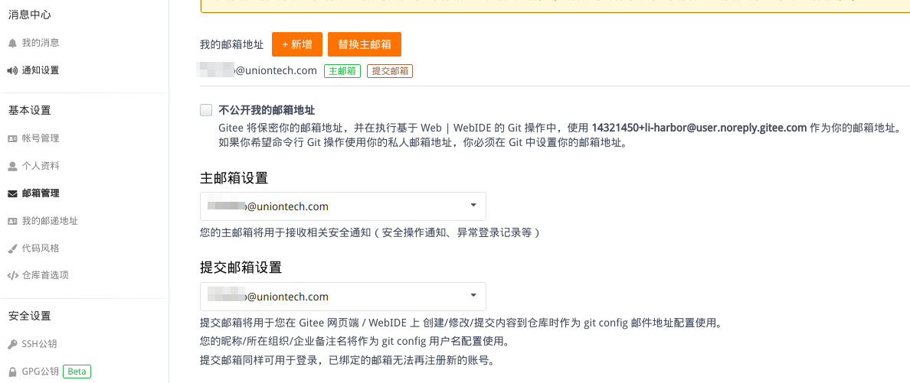
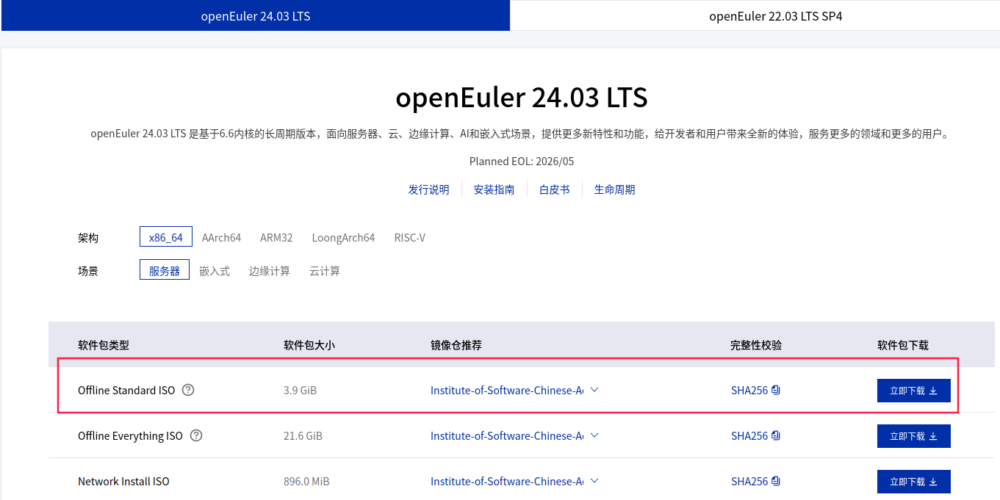
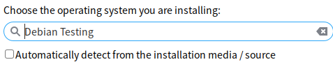

# 环境准备

## 签署cla流程

（1）签署cla

签署地址：https://clasign.osinfra.cn/sign/gitee_openeuler-1611298811283968340

```bash
选择【法人贡献者登记】
邮箱填【公司邮箱】
法人选择【统信软件技术有限公司】
```
（2）审批cla
```bash
签署后联系 吕从庆 审批
审批完成检查：
https://clasign.osinfra.cn/api/v1/individual-signing/gitee_openeuler-1611298811283968340?email=sunqingwei@uniontech.com
把email换成自己的邮箱在浏览器地址中粘贴上去，返回的是true就是已经签署通过的了
```
（3）gitee个人设置配置cla签署的邮箱


（4）

## 下载并且配置欧拉虚拟机

**首先，重中之重，找一台高配置的机器来配置虚拟机，否则会卡的要死，浪费时间并且血压飙升*****

（1）下载欧拉最新镜像

镜像下载网址：https://www.openeuler.org/zh/download/?version=openEuler%2024.03%20LTS下载最新24.03镜像



（2）安装KVM

命令行下载KVM

```bash
sudo apt install -y libvirt0 libvirt-daemon qemu virt-manager bridge-utils libvirt-clients python-libvirt qemu-efi uml-utilities virtinst qemu-system 
```

虚拟机安装可参照https://tdoc.uniontech.com/%E7%BC%96%E7%A8%8B%E5%9F%BA%E7%A1%80/Linux/%E5%B7%A5%E5%85%B7%E4%BD%BF%E7%94%A8/KVM%E5%AE%89%E8%A3%85%E9%85%8D%E7%BD%AE%E5%8F%8A%E4%BD%BF%E7%94%A8%E8%AF%B4%E6%98%8E.html

也可直接在启动器中打开“虚拟系统管理器”，在UI界面进行配置安装欧拉虚拟机，步骤很简单，尽量多给虚拟机分配资源即可



（3）配置欧拉虚拟机环境

进入虚拟机后，由于欧拉镜像不自带gui界面，因此我们需要通过以下操作自行安装gui

```bash
进入/etc/yum.repos.d/目录，在目录下依次运行以下命令
yum update
yum install dde
systemctl set-default graphical.target
reboot
安装可能需要很长时间，最后reboot即可看到图形化界面
```

虚拟机不自带输入法，运行以下命令安装拼音输入法

```bash
sudo yum install ibus-libpinyin
```

运行之后重启虚拟机，即可在输入法配置中找到拼音输入法

# 部署youqu3

```bash
pip3 install youqu3

youqu3 envx
```

## Ruff

## 安装 Ruff

```bash
pip3 install ruff
```

### 代码检查

```bash
ruff check .
```

### 代码格式化

```bash
ruff format .
```

#  Pull Requests提交

## 向仓库提交Pull Requests时应当注意

为确保提交的代码身份被 Gitee 正确识别，执行以下命令完成配置

```bash
git config --global user.name 'gitee_name' 
git config --global user.email 'gitee_email@uniontech.com'
gitee_name与gitee_email根据自己信息替换
```

初次使用 SSH 协议进行代码克隆、推送等操作时，需按下述提示完成 SSH 配置

1 生成 RSA 密钥

```bas
ssh-keygen -t rsa
```

2 获取 RSA 公钥内容，并配置到 个人设置-SSH公钥 中

```bas
cat ~/.ssh/id_rsa.pub
```

## 提交规范

**1、每次提交的pr只能包含一条提交，若包含多个提交，则要删除本地仓库，对仓库重新进行fork后，再次进行提交**

**2、提交的pr应当是独立的，不能影响其他文件的功能，不可影响其他用例的执行**

**3、提交pr时要在标题中对提交的内容进行简单描述，要求清晰明了**

**4、pr的内容应当是有价值的，无关紧要的内容或是非常简单的优化可以与其他内容一起提交**

**5、提交的代码应当注重规范性，提交前要对代码的格式与内容进行检查**

