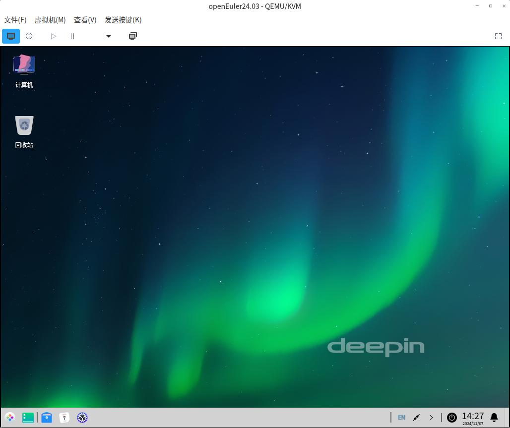

# DDE Autotest Euler

DDE Autotest for openEuler, based on [YouQu](https://youqu.uniontech.com/).

**openEuler** 系统 **DDE** 桌面自动化测试。

[](https://gitee.com/openeuler/dde_autotest_euler/stargazers)
[](https://gitee.com/openeuler/dde_autotest_euler/members)

## 安装系统

- 安装 [openEuler](https://www.openeuler.org/zh/download/) **24.03 LTS**

- 通过以下步骤切换 DDE 桌面环境：

    ```bash
    sudo yum install dde -y
    sudo systemctl set-default graphical.target
    sudo reboot
    ```
    



## 环境部署

以下所有操作在 DDE 桌面环境下进行，且**不在 root 用户下操作**，

建议新建一个普通管理员用户：**uos**

```bash
sudo pip3 install youqu-framework
# 初始化工程
youqu-startproject dde
# 安装git
sudo yum install git -y
# 克隆用例仓库
cd dde/apps/
git clone https://gitee.com/openeuler/dde_autotest_euler.git
```

```bash
dde/apps/
├── dde_autotest_euler
│   ├── __init__.py
│   ├── case
│   ├── method
│   ├── config.py
│   ├── conftest.py
│   ├── dde.csv
│   ├── LICENSE
│   └── README.md
```

**配置测试机的密码**

配置文件：
```bash
setting/globalconfig.ini
```

修改配置文件：
```ini
;测试机的密码
PASSWORD = <PASSWORD>
```

**安装依赖**

```bash
cd dde/
bash env.sh -D
```

**安装截图工具**
```
sudo yum install xcomposite xfixes xinerama -y # 工具依赖
wget https://github.com/resurrecting-open-source-projects/scrot/releases/download/1.12.1/scrot-1.12.1.tar.gz
tar -xf scrot-1.12.1.tar.gz 
cd scrot-1.12.1
./configure
make
sudo make install
```

## 运行

```bash
# 在项目根目录下运行
python3 manage.py run
```

更多运行方式请查看文档：https://youqu.uniontech.com/

## 提交规范

- 每次提交的 PR 只能包含一条提交。

- 提交 PR 时要在标题中对提交的内容进行简单描述，要求清晰明了。

- PR 的内容应当是有价值的，无关紧要的内容或非常简单的优化可以与其他内容一起提交。

- 提交的代码应当注重规范性，提交前要对代码的格式与内容进行检查。

## 开发文档

[开发文档](./API_DOCUMENTATION_ch.md)

## 常见问题
Q: OCR识别、图像识别服务器不可用？

> A: OCR识别、图像识别等服务器仅对内网开放，外部可自行部署或者联系公司技术支持。

## 用例列表

[在线表格](https://doc.weixin.qq.com/sheet/e3_Ab8A1gYLABUA8lV99qfQWO7XU3Vhn?scode=AEoAsgdxAAYAl5RLlkAJgAbQaKAB8&tab=BB08J2)


[](https://gitee.com/openeuler/dde_autotest_euler)
