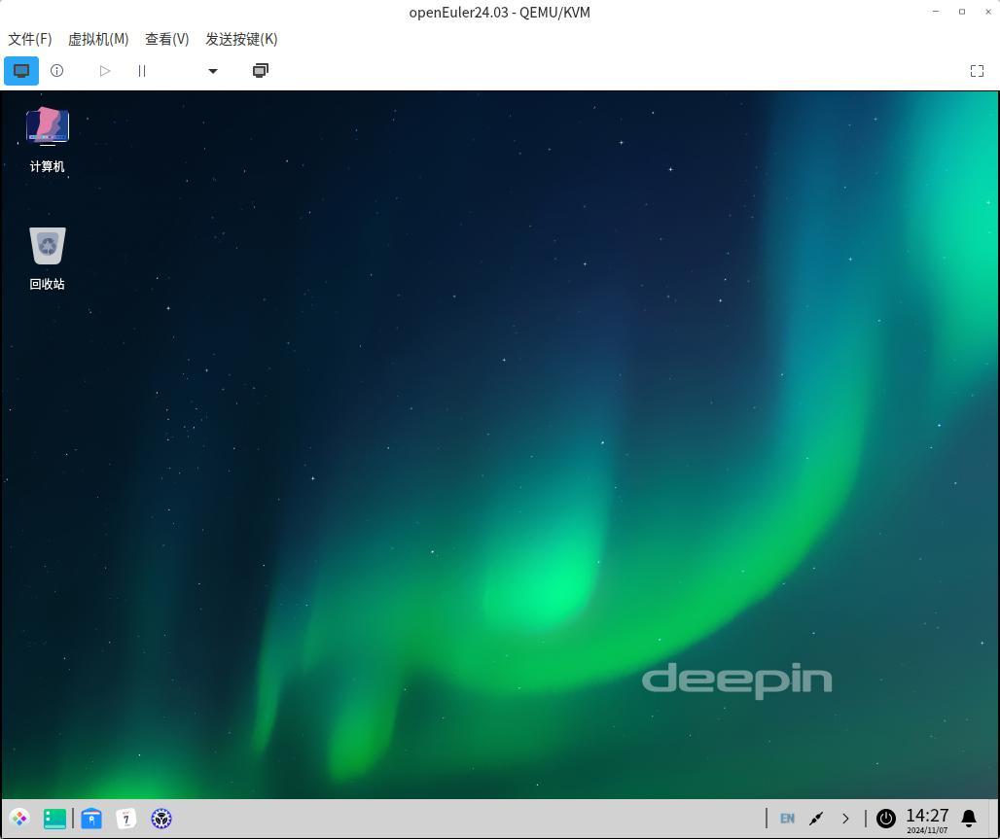

# DDE Autotest Euler

DDE Autotest for openEuler, powered by [YouQu](https://youqu.uniontech.com/).

Automated GUI testing for the Deepin Desktop Environment (DDE) on openEuler systems.

[](https://gitee.com/openeuler/dde_autotest_euler/stargazers)
[](https://gitee.com/openeuler/dde_autotest_euler/members)

## OS Installation and Setup

- Install [openEuler](https://www.openeuler.org/zh/download/) **24.03 LTS**

- Switch to the DDE:

    ```bash
    sudo yum install dde tar git -y
    sudo systemctl set-default graphical.target
    sudo reboot
    ```



## Environment Deployment

All subsequent operations must be executed within the DDE GUI environment under a **non-root** user.

It is highly recommended to create a standard administrator user named **uos**.

```bash
sudo pip3 install youqu-framework
# Initialize the project.
youqu-startproject dde
# Install editing utilities and the IBus input method. After installation, add the Chinese input method under IBus Preferences.
sudo yum install vim ibus-libpinyin -y
# Clone the test case repository.
cd dde/apps/
git clone https://gitee.com/openeuler/dde_autotest_euler.git
```

```bash
dde/apps/
├── dde_autotest_euler
│   ├── __init__.py
│   ├── case
│   ├── method
│   ├── config.py
│   ├── conftest.py
│   ├── dde.csv
│   ├── LICENSE
│   └── README.md
```

Configure Test Machine Credentials

Configuration file:

```bash
cd dde/
vim setting/globalconfig.ini
```

Modification:

```ini
;Password of the target machine
PASSWORD = <PASSWORD>
```

Required Dependencies:

```bash
cd dde/
bash env.sh -D
```

Screenshot Tool:

```bash
cd dde/apps/dde_autotest_euler/tools/
bash install_scrot.sh
```

xdotool:

```bash
cd dde/apps/dde_autotest_euler/tools/
bash install_xdotool.sh
```

## Execution

```bash
# Executed in the root directory
python3 manage.py run
```

For advanced execution configurations, refer to [YouQu documentation](https://youqu.uniontech.com/).

## PR Submission Guidelines

- Each submitted PR must contain exactly one commit.

- The PR title should provide a clear, concise summary of the proposed changes.

- Ensure that the content of the PR adds significant value. Minor adjustments or minor refactoring should be grouped and submitted alongside major changes.

- Prioritize code standards and compliance. Perform formatting checks and static analysis before submission.

## Resources

[Development Documentation](./API_DOCUMENTATION_ch.md)

## FAQs

Q: Why are the OCR and Image Recognition servers unreachable?

> A: They are hosted on an internal network. External contributors must deploy their own local recognition servers or contact corporate technical support for assistance.

## Test Cases

[Online Table](https://doc.weixin.qq.com/sheet/e3_Ab8A1gYLABUA8lV99qfQWO7XU3Vhn?scode=AEoAsgdxAAYAl5RLlkAJgAbQaKAB8&tab=BB08J2)

[Fork me on AtomGit](https://atomgit.com/openeuler/dde_autotest_euler)
